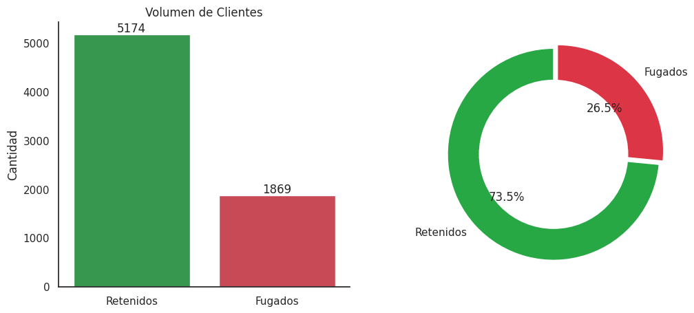
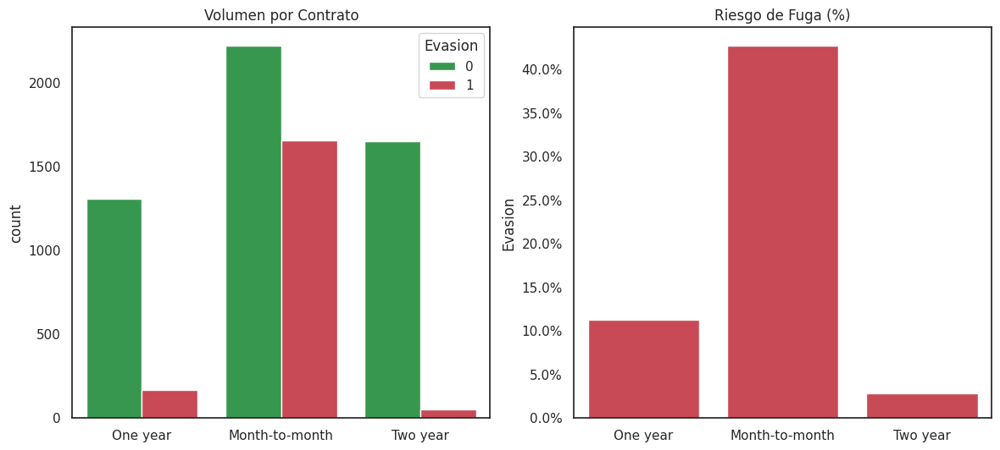
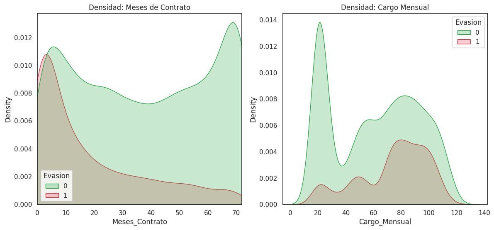
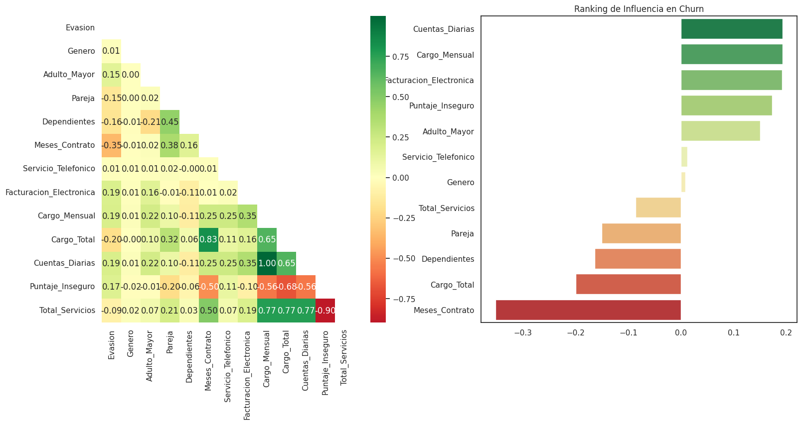

# 📄 Informe Final: Análisis de Evasión de Clientes (Churn)
**Proyecto:** Gestión PyME Inteligente  
**Analista:** Miyen (Lic. en Informática - UNPSJB)

---

## 1. Introducción
El objetivo de este proyecto es abordar el problema de la **evasión de clientes (Churn)** en la empresa Telecom X. A través de la analítica de datos, buscamos identificar patrones de comportamiento que permitan a la PyME anticiparse a la pérdida de clientes y mejorar su rentabilidad mediante estrategias de retención basadas en evidencia.

## 2. Limpieza y Tratamiento de Datos
El proceso de preparación de datos incluyó etapas críticas para asegurar la calidad de los modelos predictivos:
* **Importación y Estructuración:** Se transformaron datos de origen JSON/Diccionario en un DataFrame plano para su manipulación.
* **Traducción y Binarización:** Se estandarizaron las categorías al español y se convirtieron variables cualitativas en valores numéricos (0 y 1) para permitir el análisis estadístico.
* **Ingeniería de Características (Feature Engineering):**
    * Se creó **Cuentas_Diarias** para analizar el impacto del gasto micro-diario.
    * Se desarrollaron los indicadores **Puntaje_Inseguro** y **Total_Servicios** para validar la lealtad técnica del cliente.
* **Tratamiento de Nulos:** Se identificaron y corrigieron valores nulos en `Cargo_Total` (clientes con antigüedad cero).

## 3. Análisis Exploratorio de Datos (EDA)

### 3.1. Distribución de la Evasión
La cartera presenta una tasa de evasión del **26.5%**. Este desequilibrio requiere un enfoque específico en los factores que empujan al 1,869 clientes a abandonar el servicio.

### 3.2. Patrones de Riesgo Identificados
El análisis reveló que el **Tipo de Contrato** es el factor más determinante: los clientes con contratos mensuales tienen un riesgo de fuga del **42.7%**. Asimismo, los métodos de pago manuales (como cheque electrónico) muestran una mayor volatilidad.

### 3.3. Análisis de Variables Numéricas
Se detectó un punto crítico de deserción en los primeros **10 meses** de servicio, con un pico máximo a los 3 meses. En términos de costo, los cargos mensuales superiores a **$70** presentan una distribución trimodal con mayor riesgo de fuga en el segmento Premium.

## 4. Conclusiones e Insights
* **Antigüedad (Tenure):** Es el principal retenedor, con una correlación negativa de **-0.35** respecto a la evasión.
* **Hipótesis Validada:** Los clientes con un alto **Puntaje_Inseguro** (falta de servicios de valor agregado como seguridad y soporte) tienen un riesgo de fuga significativamente mayor ($r = 0.17$).
* **Impacto Económico:** El cargo mensual y el gasto diario actúan como aceleradores de la evasión cuando superan umbrales psicológicos del cliente.

## 5. Recomendaciones Estratégicas
1. **Plan de Bienvenida:** Reforzar la atención al cliente durante el primer semestre (meses 0-6) para superar el umbral crítico de deserción.
2. **Promoción de Servicios Técnicos:** Incentivar la adopción de seguridad online y respaldo para aumentar el "costo de salida" y reducir el riesgo técnico.
3. **Conversión Contractual:** Ofrecer beneficios exclusivos para migrar a clientes de contratos mensuales a planes anuales o bianuales.
4. **Automatización de Pagos:** Fomentar el uso de débito automático para reducir la fricción en el proceso de pago y mejorar la retención.